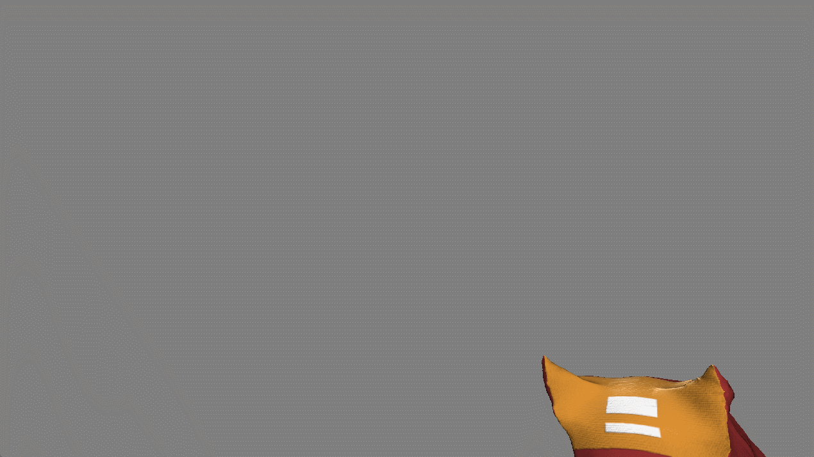
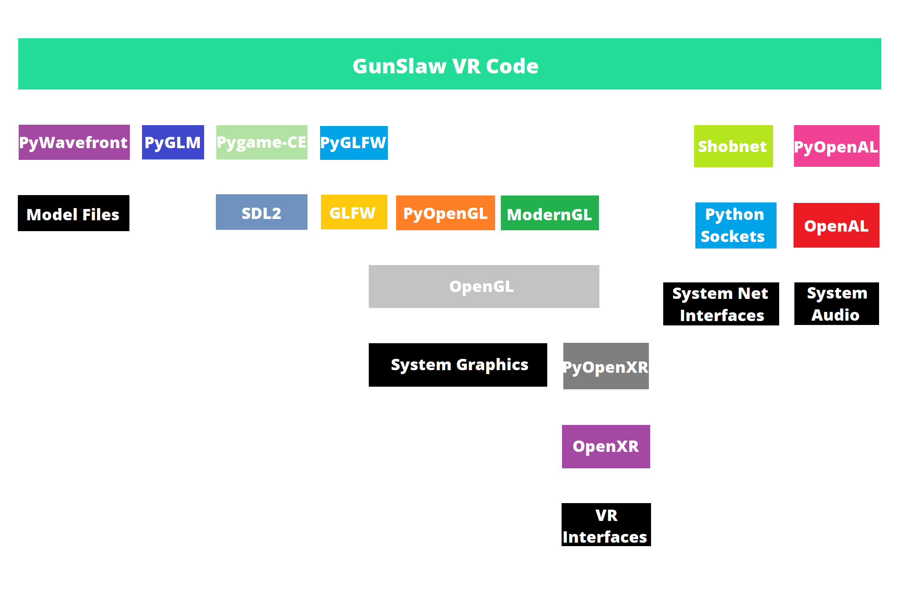

**This repository is an example Python VR project.**

This was originally meant to be boilerplate for VR gamedev with ModernGL, Pygame, GLFW, and PyOpenXR, but I ended up going straight for making something functional. Some of the naming is strange as a result. There's a lot of spaghetti and dead code that I left in there as well. I'm cleaning it up in the closed source version for a multiplayer project.

Various portions of the code are not fully optimized. The pathfinding especially can bog things down a bit. I get a stable 72fps with Link to my Quest 3 still. World generation and navmesh generation can take a few seconds when starting the demo.

I'm not entirely sure how OpenXR binding suggestions work. I've specified them for the Oculus Touch Controllers. They may or may not work for other controllers like the Index. I haven't looked into it. If it doesn't work, you can play around with the hardcoded bindings in `xrinput.py`. I only own a Rift CV1 and a Quest 3. lol

Audio device selection is hardcoded to select the Oculus Virtual Audio Device, which may cause some issues on some setups.

I'll be working more with other headsets soon, so I may update this README as I learn stuff that may affect this repository.

**Controls (Oculus Touch):**
- Left Stick: Movement (hand oriented, not head)
- Right Stick: Snap Turn
- X: Jump
- B/Y: Mag Release
- Grip: Grab (weapons)
- Trigger: Grab (mags/bolts) & Shoot

Some interactions are restricted to the applicable hand depending on how an item is held. All grabs need to be held continuously. Some games implement grabbing as a toggle; this is not one of them.

Health and kills (on your current life) are shown on the watch face. Extra mags for your current weapon are at your hips.

**Architecture:**
I made an architecture chart for my private continuation of this project ([GunSlawVR](https://dafluffypotato.com/gunslaw)) so you can see how all the dependencies are used. The only difference between this and the latest architecture is the addition of my framework Shobnet for netcode, which doesn't exist in this demo. There's also not as much GLM usage in this demo, which makes the math quite spaghetti.

**The PyOpenXR version listed in the requirements.txt may be incorrect! There was a memory leak in PyOpenXR when I was working on this project. I fixed it in a PR and it's been merged in, but the release was posted to PyPI after I forked GunSlaw VR to its own project, so I haven't tested this with it. The version in the requirements.txt is the first version with my fix in it (untested).**